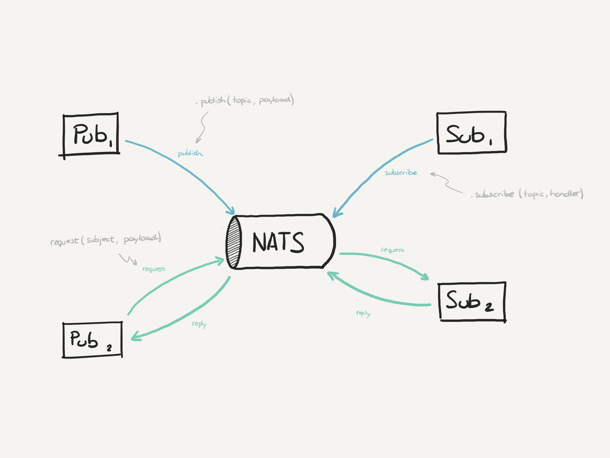

# xk6-nats

This is a [k6](https://go.k6.io/k6) extension using the [xk6](https://github.com/k6io/xk6) system, that allows to use NATS protocol.

| :exclamation: This is a proof of concept, isn't supported by the k6 team, and may break in the future. USE AT YOUR OWN RISK! |
|------|

## Build

To build a `k6` binary with this extension, first ensure you have the prerequisites:

- [Go toolchain](https://go101.org/article/go-toolchain.html)
- Git

1. Install `xk6` framework for extending `k6`:
```shell
go install go.k6.io/xk6/cmd/xk6@latest
```

2. Build the binary:
```shell
xk6 build --with github.com/ydarias/xk6-nats@latest
```

3. Run a test

```shell
k6 run -e NATS_HOSTNAME=localhost test/test.js
```

To run JetStream test, make sure NATS JetStream is started, e.g. `nats-server -js`

```shell
k6 run -e NATS_HOSTNAME=localhost test/test_jetstream.js
```

To run publish with headers test, make sure NATS JetStream is started, e.g. `nats-server -js`

```shell
./k6 run -e NATS_HOSTNAME=localhost folder/test_headers.js
```

## API

### Nats

A Nats instance represents the connection with the NATS server, and it is created with `new Nats(configuration)`, where configuration attributes are:

| Attribute | Description |
| --- | --- |
| servers | (mandatory) is the list of servers where NATS is available (e.g. `[nats://localhost:4222]`) |
| unsafe | (optional) allows running with self-signed certificates when doing tests against a testing environment, it is a boolean value (default value is `false`) |
| token | (optional) is the value of the token used to connect to the NATS server |

#### Available functions

| Function | Description |
| --- | --- |
| publish(topic, message) | publish a new message using the topic (string) and the given payload that is a string representation that later is serialized as a byte array |
| publisWithHeaders(topic, message, headers) | publish a new message using the topic (string), the given payload that is a string representation that later is serialized as a byte array and the headers |
| subscribe(topic, handler) | subscribes to the publication of a message using the topic (string) and a handler that is a function like `(msg) => void` |
| request | sends a request to the topic (string) and the given payload as string representation, and returns a message |

#### Return values

A message return value has the following attributes:

| Attribute | Description |
| --- | --- |
| data | the payload in string format |
| topic | the topic where the message was published |
| headers | the headers of the message |

**Some examples at the section below**.

## Testing

NATS supports the classical pub/sub pattern, but also it implements a request-reply pattern, this extension provides support for both.



### Pub/sub test

```javascript
import {check, sleep} from 'k6';
import {Nats} from 'k6/x/nats';

const natsConfig = {
    servers: ['nats://localhost:4222'],
    unsafe: true,
};

const publisher = new Nats(natsConfig);
const subscriber = new Nats(natsConfig);

export default function () {
    subscriber.subscribe('topic', (msg) => {
        check(msg, {
            'Is expected message': (m) => m.data === 'the message',
            'Is expected topic': (m) => m.topic === 'topic',
        })
    });

    sleep(1)

    publisher.publish('topic', 'the message');

    sleep(1)
}

export function teardown() {
    publisher.close();
    subscriber.close();
}
```

Because K6 doesn't provide an event loop we need to use the `sleep` function to wait for async operations to complete.

### Request-reply test

```javascript
import { Nats } from 'k6/x/nats';
import { check, sleep } from 'k6';

const natsClient = new Nats({
  servers: ['nats://localhost:4222'],
});

export default function () {
    const payload = {
        foo: 'bar',
    };

    const res = natsClient.request('my.subject', JSON.stringify(payload));

    check(res, {
        'payload pushed': (r) => r.status === 'success',
    });
}

export function teardown() {
    natsClient.close();
}
```

### JetStream test

The extension also supports certain JetStream features: `jetStreamSetup`, `jetStreamDelete`, `jetStreamPublish`, `jetStreamSubscribe`.

Refer to nats-io's `StreamConfig` for configuration. Custom structs are implemented as enum, e.g. storage_type = 0 for file storage and 1 for memory.

Links:

[StreamConfig](https://github.com/nats-io/nats.go/blob/main/jsm.go)
[Custom fields](https://github.com/nats-io/nats.go/blob/main/js.go)

```javascript
import {check, sleep} from 'k6';
import {Nats} from 'k6/x/nats';

const natsConfig = {
    servers: ['nats://localhost:4222'],
    unsafe: true,
};

const sub = "foo"

const streamConfig = {
    // snake case
    name: "mock",
    subjects: [sub],
    max_msgs_per_subject: 1,
    discard: 0,
    storage_type: 1
}

const subscriber = new Nats(natsConfig);
const publisher = new Nats(natsConfig);

export default function () {

    publisher.jetStreamSetup(streamConfig)
    sleep(3)
    publisher.jetStreamPublish(sub, "I am a foo")
    sleep(1)

    // const sub = "foo"

    subscriber.jetStreamSubscribe(sub, (msg) => {
        check(msg, {
            'Is expected message': (m) => m.data === "I am a foo",
            'Is expected stream topic': (m) => m.topic === sub,
       })
    });

    sleep(1)

}

export function teardown() {
    subscriber.close();
    publisher.jetStreamDelete("mock")
    sleep(1)
    publisher.close();
}
```
